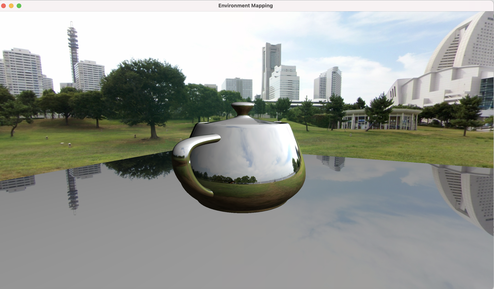
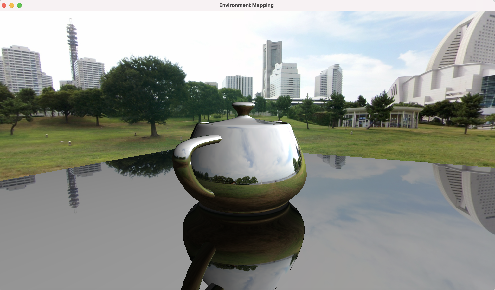

Project 6

Rendering of the sphere with the correct reflections of the environment map on it

Rendering of the teapot with correct reflections of the environment map on it

Rendering of the sphere with blinn shading

Rendering of teapot with blinn shading

Rendering of the teapot on a reflective plane

Rendering of the teapot on the reflective plane with the reflection of the teapot

In addition to the previous project

1. Process the vertices and normal for the cube which will be used to draw the environment using the environment cube map.
2. Load the required texture data for the environment cube map.
3. Generate the cube map texture using the loaded texture data
4. In the main render loop
  1. The main object fragment shader was modified to calculate environment reflections using the environment cube map.
  2. Disable depth mask
  3. Draw the cube object scaled to a large size and texture the surface of the cube by sampling the cubemap.
  4. Enable depth mask
  5. Render the object scaled in the y-axis to a render-to-texture framebuffer to be used as texture for object reflections in the plane.
  6. Draw the plane, the plane fragment shader uses the cube map for the surface environment reflections and the render-to-texture for object reflection. Blend the reflections on the plane using the Alpha channel

https://user-images.githubusercontent.com/16291248/211943394-060e212e-1d5c-427f-8183-dd34af08a21f.mp4

How to use your implementation

1. Compile the texture.cpp file, cyCodeBase must be present in the include path

clang++ -std=c++11 -stdlib=libc++ EnvironmentMapping.cpp lodepng.cpp -o EnvironmentMapping -lglfw -lglew -framework OpenGL -I/Users/u1316087/Downloads/homebrew/include/ -L/Users/u1316087/Downloads/homebrew/lib/

1. Run the executable

./EnvironmentMapping teapot2.obj

1. Controls

The mouse left button with CNTRL enables rotating the light source in world space.

The mouse left/right button with OPTION/ALT pressed controls the plane

The mouse left/right button pressed controls the object.

What operating system and compiler you used
 Operating System: macOS 11.3 Big Sur

GLFW version: 3.3.6

GLEW version: 2.2.0\_1

Compiler:
 Apple clang version 12.0.5 (clang-1205.0.22.11) Target: x86\_64-apple-darwin20.4.0

External libraries and additional requirements to compile the project.

cyCodeBase, GLFW and GLEW are required
